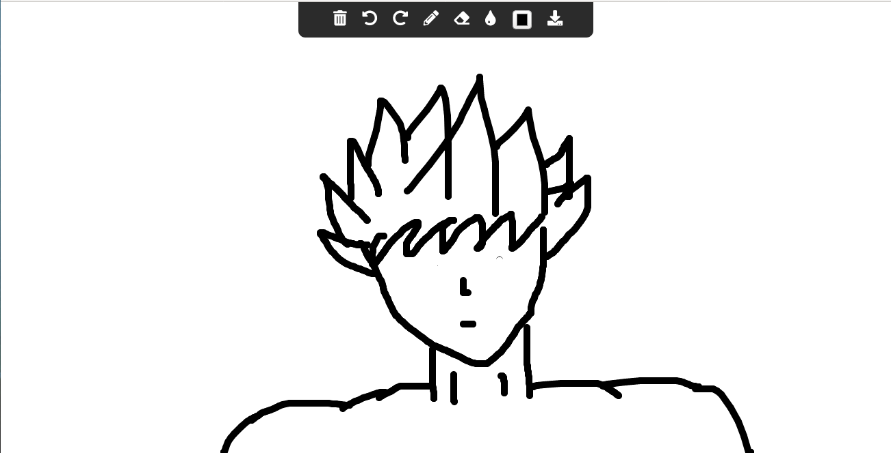

# WEBBOARD - Whiteboard for Web

A Drawing Surface made by simple application of HTML5 Canvas. [Check it Out](https://ronak66.github.io/Webboard)

## Features
* Multiple Pen Colors
* Save your Images offline and share it with other!
* Supports all types of devices ranging from Computer to Mobile Phones.

## Features (Coming Soon)
The project is still in development phase. Lot more features yet to come! Some of them are :

* Changing Pen width.
* Adding text to your Drawing.
* Uploading Images and Drawing on them.
* Preset Shapes (circles, rectangles, lines, curves etc)
