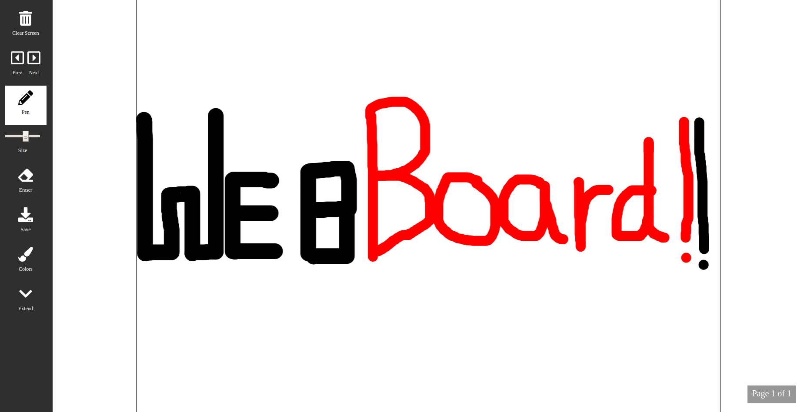

# WEBBOARD - Whiteboard for Web

A Drawing Surface made by simple application of HTML5 Canvas. [Check it Out](https://r-arvind.github.io/Webboard)

## Features
* Multiple Pen Colors
* Save your Images offline and share it with other!
* Supports all types of devices ranging from Computer to Mobile Phones.

## Features (Coming Soon)
The project is still in development phase. Lot more features yet to come! Some of them are :

* Changing Pen width.
* Adding text to your Drawing.
* Uploading Images and Drawing on them.
* Preset Shapes (circles, rectangles, lines, curves etc)

## Contributors

### Ronak Doshi
* [https://github.com/ronak66](https://github.com/ronak66)
* [https://ronak66.github.io](https://ronak66.github.io)

### Nithin Raj
* [https://github.com/nithinr07](https://github.com/nithinr07)
* [https://nithinr07.github.io](https://nithinr07.github.io)

### R Arivnd
* [https://github.com/r-arvind](https://github.com/r-arvind)
* [https://r-arvind.github.io](https://r-arvind.github.io)

### Check Out Final Version Of WEBBOARD
* [WebBoard](https://webboard.zense.co.in)
